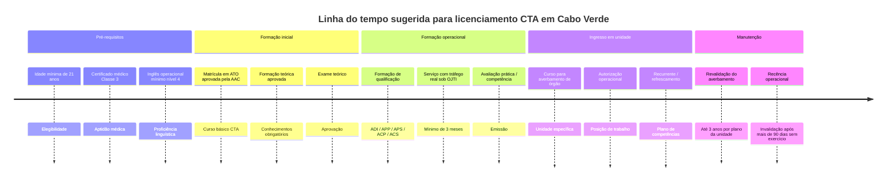
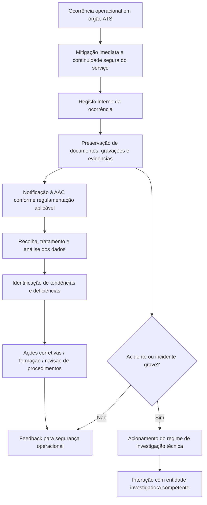

# Base de conhecimento autoritativa sobre controladores de tráfego aéreo em Cabo Verde

## Resumo executivo

Cabo Verde possui uma arquitetura institucional de navegação aérea claramente separada entre regulação e prestação dos serviços. A equivalente cabo-verdiana de ANAC/INAC é a **AAC — Agência de Aviação Civil**, criada no quadro regulatório nacional e atualmente regida pelos Estatutos aprovados pelo Decreto-Lei n.º 47/2019. A prestação operacional dos serviços de tráfego aéreo, nas fontes oficiais consultadas, aparece associada à **ASA — Navegação Aérea de Cabo Verde, S.A.**, sediada na ilha do Sal. Desde 2023, a gestão concessionada dos **4 aeroportos e 3 aeródromos** do país passou para a **Cabo Verde Airports, S.A.**, mas a documentação pública pesquisada continua a apontar a ASA como o prestador diretamente ligado às operações ATS e ao centro de controlo. citeturn27search0turn8search0turn8search2turn7search1turn7search3

A base normativa central para o tema dos controladores de tráfego aéreo em Cabo Verde está hoje distribuída, principalmente, pelo **Código Aeronáutico**, pelo **CV-CAR 17** para serviços de tráfego aéreo, pelo **CV-CAR 2.3 (2026)** para licenciamento de CTA, pelo **CV-CAR 2.4** para exigências médicas, pela **Diretiva n.º 01/PEL/2024** para restabelecimento de privilégios após períodos sem exercício, e pelo **CV-CAR 22** para notificação de ocorrências. O CV-CAR 2.3 de 2026 é especialmente importante porque atualiza o regime anterior: a própria introdução do regulamento informa que a revisão **eliminou a validade da licença em si**, concentrando a disciplina na emissão, revalidação e renovação de qualificações, averbamentos e designações. Isso significa que, para um site autoritativo, o texto normativo de 2026 deve prevalecer sobre páginas informativas antigas da própria AAC. citeturn14view0turn25search3turn13view2turn14view2turn34search0

Do ponto de vista operacional, Cabo Verde mantém a **FIR Oceânica do Sal**, criada pelo Decreto-Lei n.º 9/80, com integração histórica dos serviços, instalações, equipamentos e pessoal no Aeroporto Internacional Amílcar Cabral. Nas fontes oficiais da ASA, a estrutura ATS atualmente descrita inclui um **Centro de Controlo de Tráfego Aéreo no Sal**, torres de controlo no **Sal, Praia, Boa Vista e São Vicente**, e **Serviço de Informação de Voo** em **São Filipe, Maio e São Nicolau**. Quanto ao limite superior exato de UTA/UIR aplicável na documentação pública revisada para esta pesquisa, o dado ficou **não especificado**. citeturn30view1turn8search2turn32search12

O caminho regulatório para se tornar CTA em Cabo Verde, em sua forma básica, exige pelo menos **21 anos**, curso aprovado, exame teórico, **3 meses de serviço satisfatório com controlo real de tráfego aéreo sob supervisão de OJTI**, certificado médico **Classe 3** e proficiência linguística mínima **Nível Operacional 4** em inglês para radiotelefonia. Para atuação numa unidade específica, o titular também precisa de **averbamento de órgão de controlo**, cuja validade é definida no plano de competências da unidade, nunca superior a **3 anos**, e que se torna inválido após mais de **90 dias** sem exercício dos privilégios. citeturn15view2turn16view0turn16view2turn16view3turn17view0

Em termos de condições de trabalho, o CV-CAR 17 impõe salvaguardas claras de fadiga: mínimo de **5 minutos por mudança de turno** em posições operacionais ATS, local de descanso, limite de **6 horas** de trabalho contínuo antes de pausa fora do ambiente ATC e duração máxima de turno de **8 horas**. Também exige sistema de qualidade, SMS aprovado e sistema de notificação de ocorrências para análise de tendências e correção de deficiências. Isso fornece uma base regulatória sólida para qualquer futura associação profissional defender condições seguras de trabalho e uma cultura justa de segurança. citeturn35view3turn35view4turn35view5turn34search0

Nas fontes primárias oficiais consultadas, **não foi identificada** uma associação setorial formal com estatutos públicos localizados para controladores de tráfego aéreo. Contudo, em 2025, a imprensa cabo-verdiana passou a mencionar uma **Associação Cabo-verdiana dos Controladores de Tráfego Aéreo (ACCTA)**, o que sugere que já existe algum grau de organização coletiva, mas cuja situação registral e estatutária precisa ser verificada antes de qualquer uso institucional no site. Para fins prudenciais e de governança, esta base recomenda tratar o tema como **“existência a confirmar documentalmente”**. citeturn36search12turn36search4

## Definições oficiais e escopo

Em Cabo Verde, a autoridade pública responsável pela regulação técnica e económica do setor aeronáutico é a **AAC — Agência de Aviação Civil**, aprovada pelo Decreto-Lei n.º 47/2019. Para o público brasileiro e lusófono, ela cumpre, na prática, o papel equivalente ao de uma ANAC/INAC nacional. citeturn27search0turn27search4

No plano internacional, o **Anexo 11 da ICAO** define os **Air Traffic Services** como o conjunto de serviços de controlo de tráfego aéreo, informação de voo e alerta, e estabelece como objetivos: prevenir colisões entre aeronaves; prevenir colisões entre aeronaves e obstáculos na área de manobras; acelerar e manter o fluxo ordenado do tráfego aéreo; e fornecer informações úteis à condução segura e eficiente dos voos. O **CV-CAR 17** cabo-verdiano reproduz essa lógica e divide o ATS em três blocos: **ATC**, **FIS** e **serviço de alerta**. citeturn24search1turn35view2

O **serviço de controlo de tráfego aéreo** em Cabo Verde, segundo o CV-CAR 17, desdobra-se em **controlo de área**, **controlo de aproximação** e **controlo de aeródromo**. O próprio regulamento indica que o serviço de controlo de área é prestado pelo **centro de controlo**, o de aproximação pelo **centro de controlo e torres quando aplicável**, e o de aeródromo pela **torre de controlo**. citeturn35view2

No regime de licenciamento, o **CV-CAR 2.3 (2026)** não traz, no trecho consultado, uma definição isolada de “controlador de tráfego aéreo” em linguagem leiga, mas deixa claro que a licença CTA existe para permitir o exercício de privilégios associados a **qualificações** e **averbamentos**, inclusive o **averbamento de órgão de controlo**, que autoriza a prestação de serviços ATC em um determinado órgão ou posição operacional. Em termos editoriais para o site, a definição mais fiel ao regulamento é: **CTA é o profissional licenciado pela AAC para exercer, em órgão ATS específico, os privilégios das qualificações de aeródromo, aproximação ou área, conforme qualificação, averbamento de órgão e requisitos médicos e linguísticos aplicáveis**. Essa formulação é uma inferência fiel ao texto normativo. citeturn14view0turn16view5turn16view6

Também convém diferenciar, no site, **aeródromo** e **aeroporto**. A própria AAC define **aeródromo** como a área delimitada de terra ou água, com edificações, instalações e equipamentos, destinada total ou parcialmente à chegada, movimento e partida de aeronaves; e **aeroporto** como o aeródromo público internacional, com serviços de alfândega, sanidade, imigração e afins. A mesma página informativa da AAC registra que Cabo Verde possui **7 aeródromos**, sendo **4 internacionais** e **3 domésticos**. citeturn6search4turn7search3

## Marco legal e regulatório

O sistema cabo-verdiano de aviação civil se ancora no **Código Aeronáutico**, aprovado pelo Decreto-Legislativo n.º 1/2001 e alterado pelo Decreto-Legislativo n.º 4/2009. Os regulamentos mais recentes da AAC citam expressamente o artigo 173.º do Código como base jurídica para a emissão dos CV-CAR. Em outras palavras, para efeito de hierarquia normativa, o Código é a base legal superior e os CV-CAR detalham a implementação técnica. citeturn14view0turn26search2turn27search6

O **CV-CAR 17** estabelece as normas para certificação, funcionamento e normas técnicas do prestador ATS em Cabo Verde. O **CV-CAR 2.3 (2026)** estabelece os requisitos de emissão, revalidação e renovação da licença CTA e dos averbamentos associados. O **CV-CAR 2.4** disciplina as exigências médicas aplicáveis ao pessoal aeronáutico, inclusive controladores. E o **CV-CAR 22** estrutura o regime de notificação de ocorrências com orientação preventiva e não punitiva. citeturn35view0turn14view0turn13view1turn34search0

A **FIR Oceânica do Sal** foi estabelecida pelo **Decreto-Lei n.º 9/80, de 11 de fevereiro**, que também determinou que os serviços, instalações, equipamentos e pessoal afetos ao seu funcionamento consideravam-se integrados no Aeroporto Internacional Amílcar Cabral. O decreto assegura, nesse espaço, apoio à navegação aérea de acordo com a ICAO, incluindo controlo de tráfego aéreo, telecomunicações aeronáuticas, assistência meteorológica e busca e salvamento. citeturn28view0turn30view1

A estrutura institucional contemporânea também depende do regime de concessão aeroportuária. A **Lei n.º 64/IX/2019** estabeleceu o regime jurídico da concessão do serviço público aeroportuário de apoio à aviação civil; o **Decreto-Lei n.º 14/2022** atribuiu a concessão à VINCI Airports; e documentos oficiais do Ministério das Finanças registram que, com a entrada em vigor do contrato em julho de 2023, a **Cabo Verde Airports** passou a assumir a gestão dos aeroportos e aeródromos do país. Paralelamente, a **ASA** passou a se apresentar institucionalmente como **Navegação Aérea de Cabo Verde**, o que é materialmente relevante para identificar o empregador/operador mais ligado aos CTA. citeturn27search1turn27search3turn7search1turn8search0

No plano internacional, a regulação cabo-verdiana declara aderência às normas da **ICAO**. A introdução do CV-CAR 2.3 (2026) afirma que o texto incorpora emendas recentes do **Anexo 1 — Personnel Licensing**. O portal da ICAO descreve o Anexo 1 como o anexo que contém os padrões mínimos para licenciamento de pessoal, incluindo controladores. O **Anexo 11** cobre os serviços ATS. O **Anexo 19** cobre a gestão da segurança. O site institucional da ICAO também lista o **Doc 4444 (PANS-ATM)** e o **Doc 7030** como documentos de implementação diretamente ligados ao ATS; e o próprio CV-CAR 17 manda que a separação entre voos controlados e espaço aéreo especial ativo observe os Documentos **4444 e 7030** da ICAO. citeturn14view0turn24search0turn24search1turn24search14turn24search17turn35view2

Há, porém, um ponto editorial importante para `controlador.cv`: a página informativa antiga da AAC sobre licenciamento CTA, publicada em 2018, ainda informa **validade de 5 anos** para a licença e afirma perda de validade após **6 meses** sem exercício. Já o **CV-CAR 2.3 (2026)** afirma que a revisão **eliminou a validade das licenças**, ao mesmo tempo em que passou a disciplinar com mais precisão a validade dos averbamentos. Para evitar conflito informativo, o site deve dizer claramente que, **em caso de divergência, prevalece o CV-CAR 2.3 (2026)**. citeturn9view3turn14view0turn17view0

| Documento | Hierarquia / natureza | Tema central | Relevância prática para CTA |
|---|---|---|---|
| Código Aeronáutico de Cabo Verde — Decreto-Legislativo n.º 1/2001, alterado pelo Decreto-Legislativo n.º 4/2009 | Lei de base | Base legal da regulação aeronáutica | Dá fundamento jurídico aos regulamentos técnicos da AAC |
| Decreto-Lei n.º 9/80, de 11 de fevereiro | Decreto-lei | Criação da FIR Oceânica do Sal | Fundamenta a existência da FIR e a responsabilidade ATS sobre o espaço oceânico do Sal |
| Decreto-Lei n.º 47/2019 | Decreto-lei | Estatutos da AAC | Define a autoridade reguladora competente |
| Lei n.º 64/IX/2019 | Lei | Regime jurídico da concessão aeroportuária | Importa para distinguir operador aeroportuário de prestador ATS |
| Decreto-Lei n.º 14/2022 | Decreto-lei | Atribuição da concessão à VINCI Airports | Consolidou a Cabo Verde Airports como concessionária |
| CV-CAR 17 | Regulamento técnico AAC | Serviços de tráfego aéreo | Certificação ATS, fadiga, handover, qualidade, SMS, ocorrências |
| CV-CAR 2.3 (2026) | Regulamento técnico AAC | Licenciamento CTA | Elegibilidade, curso, exame, ratings, averbamentos, instrutores e avaliadores |
| CV-CAR 2.4 | Regulamento técnico AAC | Medicina aeronáutica para CTA | Certificado Classe 3 e aptidão médica |
| Diretiva n.º 01/PEL/2024 | Diretiva AAC | Restabelecimento de privilégios | Reentrada após longos períodos sem exercício |
| CV-CAR 22 | Regulamento técnico AAC | Notificação de ocorrências | Base de cultura justa e reporte preventivo |

Fonte da tabela: documentos oficiais da AAC, BOE e ICAO. citeturn14view0turn13view1turn14view2turn35view0turn27search0turn27search1turn27search3turn34search0turn24search0turn24search1turn24search14

## Estrutura organizacional do ATC em Cabo Verde

A configuração operacional hoje visível nas fontes oficiais é a seguinte: a **ASA** se apresenta como **Navegação Aérea de Cabo Verde, S.A.**, com sede na ilha do Sal, e a sua página de operações de tráfego aéreo descreve a existência de **Centro de Controlo de Tráfego Aéreo (ACC) no Sal**, além de estruturas ATS nas torres do **Sal, Praia, Boa Vista e São Vicente**, e serviço de informação de voo em **São Filipe, Maio e São Nicolau**. Essa é a melhor fotografia oficial disponível, de alto grau de confiança, sobre a malha de órgãos ATS do país. citeturn8search0turn8search2turn32search12

Em paralelo, a **Cabo Verde Airports** lista os sete aeródromos do sistema nacional: **Aeroporto Internacional Amílcar Cabral (Sal)**, **Aeroporto Internacional da Praia — Nelson Mandela (Santiago)**, **Aeroporto Internacional Aristides Pereira (Boa Vista)**, **Aeroporto Internacional Cesária Évora (São Vicente)**, **Aeródromo de Preguiça (São Nicolau)**, **Aeródromo do Maio** e **Aeródromo de São Filipe (Fogo)**. Para o site, isso permite separar com clareza: **infraestrutura aeroportuária concessionada** de um lado, e **prestação ATS** de outro. citeturn7search3

Do ponto de vista de espaço aéreo, o marco institucional continua sendo a **FIR Oceânica do Sal**, criada em 1980. A documentação de divulgação da AAC acrescenta que, em comunicações, a FIR dispõe de **VHF, HF e CPDLC**, e, em vigilância, há cobertura radar de **três estações: Santo Antão, Sal e Santiago**, além de **ADS-C**. Essas informações são particularmente úteis para caracterizar o contexto técnico de trabalho dos CTA que atuam em área/rota e nos principais aeroportos. citeturn30view1turn13view4

A delimitação exata de **UTA/UIR** aplicável ao espaço cabo-verdiano não apareceu, de forma textual e inequívoca, nas fontes oficiais abertas efetivamente extraídas nesta pesquisa. Para um site autoritativo, o recomendável é publicar **“UTA/UIR: não especificado nesta versão; confirmar diretamente na e-AIP ou AIP vigente”** em vez de supor limites. citeturn28view0turn5search10

Sob a ótica funcional, a estrutura de CTA em Cabo Verde pode ser apresentada ao público em quatro camadas: **regulação** pela AAC; **prestação ATS** pela ASA; **gestão aeroportuária concessionada** pela Cabo Verde Airports; e, em caso de acidente ou incidente grave, **investigação técnica** regida pelo Decreto-Lei n.º 6/2023, que atribui ao IPIAAM responsabilidades na matéria. citeturn27search0turn8search0turn7search1turn33search16

| Elemento | Situação nas fontes oficiais consultadas | Entidade principal | Observação editorial para o site |
|---|---|---|---|
| Regulador aeronáutico | Identificado | AAC | Equivalente funcional de ANAC/INAC |
| FIR | FIR Oceânica do Sal | Estado de Cabo Verde / prestação ATS operacional associada à ASA | Criada pelo DL n.º 9/80 |
| UTA/UIR | **não especificado** | **não especificado** | Confirmar diretamente em AIP/e-AIP vigente |
| ACC | Identificado no Sal | ASA | Centro de Controlo de Tráfego Aéreo |
| Torres de controlo | Sal, Praia, Boa Vista, São Vicente | ASA | Órgãos ATC locais |
| FIS de aeródromo | São Filipe, Maio, São Nicolau | ASA | Órgãos FIS locais |
| Infraestrutura aeroportuária | 4 aeroportos + 3 aeródromos | Cabo Verde Airports | Gestão concessionada desde 2023 |
| Investigação técnica de acidentes/incidentes graves | Identificada | IPIAAM | Não confundir com regulação ou com reporte interno ATS |

Fonte da tabela: fontes oficiais da AAC, ASA, Cabo Verde Airports e legislação nacional. citeturn8search2turn32search12turn7search3turn7search1turn30view1turn33search16

## Formação, licenciamento e requisitos

O regime atual de licenciamento de controladores em Cabo Verde é o **CV-CAR 2.3 (2026)**. O regulamento exige que o candidato à emissão da licença CTA tenha **pelo menos 21 anos** e cumpra requisitos de conhecimentos, experiência, perícia, aptidão física e proficiência linguística. Entre as áreas obrigatórias de conhecimento estão legislação aeronáutica, equipamento ATC, conhecimentos gerais de aeronaves, desempenho humano, língua, meteorologia, navegação e procedimentos operacionais. citeturn15view2turn16view2turn16view3

A experiência mínima explicitada na regra é particularmente importante: o candidato deve completar curso de formação aprovado, demonstrar a competência exigida e realizar **pelo menos 3 meses de serviço satisfatório envolvendo controlo real do tráfego aéreo sob supervisão de um OJTI**. Esse ponto deve aparecer com destaque no site porque diferencia formação teórica de prontidão operacional. citeturn16view3turn17view3

As qualificações de CTA previstas pelo regime são cinco: **controlo de aeródromo**, **controlo de aproximação por procedimentos**, **controlo de aproximação por vigilância**, **controlo de área por procedimentos** e **controlo de área por vigilância**. O regulamento também descreve os privilégios de cada uma delas, o que permite ao site apresentar uma taxonomia clara entre TWR, APP procedural, APP surveillance, ACC procedural e ACC surveillance. citeturn9view3turn16view4turn16view5

A proficiência linguística é obrigatória. O CV-CAR 2.3 determina que CTA e instruendos demonstrem capacidade de falar e compreender a **língua inglesa** usada nas comunicações de radiotelefonia, **pelo menos no Nível Operacional 4**. A página de licenciamento da AAC também exige, para conversão de licença estrangeira, comprovação de proficiência na língua usada na radiotelefonia em Cabo Verde e em inglês. citeturn16view0turn9view3

No campo médico, um candidato à licença CTA deve passar por exame médico inicial para emissão de **Certificado Médico Classe 3**, e os titulares devem revalidá-lo nos intervalos previstos em CV-CAR 2.4. A tabela oficial de periodicidade publicada pela AAC mostra, para **Classe 3 (CTA)**, exigências como **eletrocardiograma** no exame inicial, depois em períodos de até **4 anos** antes dos 30, **2 anos** entre 30 e 49 e **1 ano** a partir de 50; e exames ORL com audiograma e oftalmológicos em periodicidades também escalonadas por idade e condição visual. citeturn9view4turn20search5turn37view0

Quanto à **recência**, o dado mais atual não é o texto informativo de 2018, mas o CV-CAR 2.3 de 2026. Hoje, o ponto mais prático para operação diária é o **averbamento de órgão de controlo**: ele vale por prazo definido no plano de competências da unidade, **não superior a 3 anos**, e se torna inválido se o CTA deixar de exercer seus privilégios por período superior a **90 dias**. Para revalidação, o controlador deve cumprir horas mínimas, formação de refrescamento e avaliação de competência conforme o plano da unidade aprovado pela autoridade aeronáutica. citeturn16view6turn17view0turn17view1

Nos casos de afastamento mais longo, a **Diretiva n.º 01/PEL/2024** e a antiga Instrução n.º 20/DSV/2015, ainda útil como material de referência histórica, mostram a gradação de restabelecimento: acima de **6 meses até 1 ano**, supervisão e verificação de competência; acima de **1 até 5 anos**, curso de refrescamento, supervisão mais prolongada e verificação; acima de **5 anos**, retorno mais pesado, com curso inicial, exames, nova qualificação e supervisão ampliada. Para o site, vale apresentar isso como **“regra de reentrada operacional”**, não como caminho normal de ingresso. citeturn14view2turn13view2

As **ATO** oficialmente aprovadas pela AAC e com cursos ATC identificados na lista mais recente disponível para esta pesquisa são, pelo menos, a **SENASA** e a **NAV Portugal**, ambas autorizadas para **ATCO Basic training**, **rating training**, qualificações de aeródromo, aproximação procedural, aproximação por vigilância, área procedural, área por vigilância, além de formação prática de instrutor e formação de avaliadores; a NAV Portugal também aparece com **refresher** e **conversion training**. citeturn23view0

Como caminho formativo adicional, há registo oficial de que o **FPEF**, em cooperação com a **SENASA**, abriu concurso para **24 vagas** em curso inicial ATC para TWR — básico e ADI/ADV — em Madrid, com **16 semanas** de duração e seleção em três fases: **teste de inglês**, **teste psicotécnico e de personalidade** e **entrevista oral em inglês/intervista de personalidade**. Isso é valioso para mostrar ao público que, em Cabo Verde, o ingresso pode ocorrer por **modelo patrocinado/selecionado** por programas públicos e pela empresa, além do trajeto geral via ATO. citeturn37view1turn32search0

A **UTA**, por meio do **ISAT** no Sal, oferece formação superior em **Gestão e Planeamento da Aviação Civil**, o que pode ser relevante como base acadêmica para o setor, mas nas páginas consultadas **não aparece como curso de licenciamento CTA**. Em um site autoritativo, o correto é classificar o ISAT como **formação acadêmica complementar/preparatória**, e não como via direta de licença de controlador. citeturn31search9turn31search4

| Certificação / título | Base normativa | Emite / aprova | Finalidade | Situação de validade / recência |
|---|---|---|---|---|
| Licença CTA | CV-CAR 2.3 (2026) | AAC | Título base profissional | A revisão de 2026 informa eliminação da validade da licença em si; prevalecem regras de qualificações e averbamentos |
| Qualificação ADI | CV-CAR 2.3 | AAC | Operar em controlo de aeródromo | Requisitos de formação e competência aplicáveis |
| Qualificação APP procedural | CV-CAR 2.3 | AAC | Aproximação sem vigilância | Requisitos de formação e competência aplicáveis |
| Qualificação APP vigilância | CV-CAR 2.3 | AAC | Aproximação com sistemas de vigilância | Requisitos de formação e competência aplicáveis |
| Qualificação ACC procedural | CV-CAR 2.3 | AAC | Área sem vigilância | Requisitos de formação e competência aplicáveis |
| Qualificação ACC vigilância | CV-CAR 2.3 | AAC | Área com sistemas de vigilância | Requisitos de formação e competência aplicáveis |
| Averbamento de proficiência linguística | CV-CAR 2.3 | AAC / examinadores reconhecidos | Radiotelefonia | Inglês mínimo Nível 4 |
| Averbamento de órgão de controlo | CV-CAR 2.3 | AAC, com base em curso e plano de competências | Autoriza trabalhar em unidade/posição específica | Validade definida no plano da unidade, até 3 anos; invalida após mais de 90 dias sem exercício |
| Certificado médico Classe 3 | CV-CAR 2.4 | Médicos examinadores designados / AAC | Aptidão médica de CTA | Revalidação periódica e exames complementares conforme tabela oficial |
| OJTI / STDI / avaliador | CV-CAR 2.3 | AAC | Formação prática e avaliação | Aplicável a CTA experientes, não ao ingresso inicial |

Fonte da tabela: CV-CAR 2.3 (2026), CV-CAR 2.4 e páginas oficiais da AAC. citeturn14view0turn16view0turn16view5turn16view6turn17view0turn13view1

| Provedor formativo | País | Certificado AAC | Cursos CTA aprovados nas fontes consultadas | Validade do certificado | Observação |
|---|---|---|---|---|---|
| SENASA | Espanha | CV-05/ATOE | ATCO Basic, rating training, ADI, APP procedural, APP surveillance, ACC procedural, ACC surveillance, instrutor prático, avaliadores | 31/07/2027 | ATO estrangeira aprovada pela AAC |
| NAV Portugal, E.P.E. | Portugal | CV-12/ATOE | Mesmo escopo CTA acima + refresher + conversion training | 25/07/2027 | ATO estrangeira aprovada pela AAC |
| UTA / ISAT | Cabo Verde | **não especificado como ATO CTA** | Formação superior em Gestão e Planeamento da Aviação Civil | **não especificado** | Via acadêmica; não foi identificada licença CTA nas páginas consultadas |
| MA Aviation Training Center | Cabo Verde | CV-07/ATO | Não identificado curso CTA na lista consultada | 30/05/2026 | Curso identificado nas fontes: tripulante de cabina |

Fonte da tabela: lista oficial de ATO aprovadas pela AAC e páginas oficiais da UTA. citeturn23view0turn31search9turn31search4



A emissão inicial acima deve ser tratada como **caminho-padrão**. Para **conversão de licença estrangeira**, a AAC publica um fluxo separado, com pedido de teste em legislação aeronáutica via **FS.PEL.09**, apresentação de licença válida, certificado médico Classe 3, documento de identificação, fotografia, pagamento de taxa de exame teórico de **4.500$00** por prova e, após aprovação, pedido de conversão via **FS.PEL.01** com pagamento de **9.000$00**, além de prova de proficiência linguística. citeturn9view3

## Trabalho, carreira e representação coletiva

O **CV-CAR 17** fornece bases bastante objetivas para tratar de condições de trabalho. O prestador ATS deve prever **mínimo de 5 minutos para cada mudança de turno** em todas as posições operacionais, disponibilizar **local de descanso** e adotar procedimentos de prevenção de fadiga. O mesmo regulamento determina que o período máximo de trabalho contínuo **não pode exceder 6 horas** sem intervalo para descanso fora do ambiente ATC, e que a duração de um turno **não deve exceder 8 horas**. Esses são parâmetros regulatórios relevantes para qualquer futura pauta associativa. citeturn35view3

As escalas específicas por órgão, a distribuição local entre turnos diurnos/noturnos e o desenho exato dos rosters em ACC, APP, TWR e FIS **não foram especificados** nas fontes públicas primárias efetivamente revisadas nesta pesquisa. Assim, o site deve distinguir **“mínimos regulatórios”** de **“escalas praticadas localmente”**. citeturn35view3

A cultura de segurança, no arcabouço cabo-verdiano, é robusta em desenho jurídico. O **CV-CAR 17** obriga o prestador ATS a ter **sistema de qualidade**, **gestor de qualidade**, **SMS aprovado pela autoridade aeronáutica** e **sistema de notificação de ocorrências** para recolha, tratamento e análise de dados visando identificar tendências adversas e resolver deficiências. Já o **CV-CAR 22** afirma expressamente que a notificação de ocorrências se destina a **prevenir acidentes e incidentes, e não a imputar culpas ou responsabilidades**. Esse enunciado é central para qualquer capítulo do site dedicado a “just culture”. citeturn35view4turn35view5turn34search0

Em termos de trajetória profissional, a melhor leitura das normas e das oportunidades públicas é a seguinte, como **inferência de alta confiança**: **instruendo CTA → controlador recém-licenciado → qualificação em TWR/APP/ACC → averbamento de órgão → controlador experiente → OJTI/STDI/avaliador → supervisão operacional / coordenação / inspeção ou trilha regulatória na AAC**. Essa inferência se apoia nas categorias de qualificação do CV-CAR 2.3, nos requisitos para OJTI e numa vaga pública da AAC para **Inspetor de Navegação Aérea**, que pedia formação de CTA e experiência relevante. citeturn16view4turn17view3turn32search4

Sobre remuneração, a conclusão responsável para um site autoritativo é: **salários de CTA em Cabo Verde: não especificado**. Nas publicações públicas examinadas nesta pesquisa, a ASA divulga concurso para formação/contratação de controladores, mas o valor remuneratório não aparece nas informações recuperadas; e vagas da própria AAC para carreiras técnicas mencionam remuneração segundo tabela salarial vigente, sem expor montantes públicos no trecho revisto. Portanto, o site deve evitar publicar faixas não oficiais. citeturn32search0turn32search6

Quanto a sindicatos e associações, nas fontes primárias oficiais consultadas **não foi localizada** uma entidade setorial com estatutos ou registo público facilmente verificável voltado especificamente a CTA. Contudo, em dezembro de 2025, a imprensa referiu a existência de uma **Associação Cabo-verdiana dos Controladores de Tráfego Aéreo (ACCTA)**. A forma prudente de redigir o site é: **“associação setorial mencionada publicamente em 2025; situação estatutária e registral a confirmar”**. citeturn36search12turn36search4

## Conteúdo pronto para controlador.cv

A seguir está um conjunto de blocos de conteúdo em Markdown, já estruturados para publicação, governança associativa e navegação do site.

**Metadados recomendados para a página principal**

```yaml
title: "Controladores de Tráfego Aéreo em Cabo Verde"
slug: "/"
description: "Base de conhecimento autoritativa sobre formação, licenciamento, requisitos médicos, estrutura ATS, carreira e representação profissional dos controladores de tráfego aéreo em Cabo Verde."
keywords:
  - controladores de tráfego aéreo Cabo Verde
  - CTA Cabo Verde
  - licenciamento CTA Cabo Verde
  - FIR Oceânica do Sal
  - AAC Cabo Verde
  - ASA navegação aérea Cabo Verde
  - formação ATC Cabo Verde
language: "pt-BR"
robots: "index,follow"
canonical: "https://controlador.cv/"
og_title: "Controladores de Tráfego Aéreo em Cabo Verde"
og_description: "Licenciamento, formação, requisitos, estrutura ATS, carreira e associação profissional."
og_type: "website"
```

**Heading principal recomendada para SEO**

- `# Controladores de Tráfego Aéreo em Cabo Verde`
- `## Como se tornar controlador de tráfego aéreo em Cabo Verde`
- `## Licença CTA, certificados e requisitos médicos`
- `## Estrutura ATS, FIR Oceânica do Sal e unidades operacionais`
- `## Associação profissional dos controladores de tráfego aéreo`

**Estrutura de navegação sugerida**

```text
Início
├── Sobre a profissão
│   ├── O que faz um CTA
│   ├── Qualificações possíveis
│   └── Estrutura ATS em Cabo Verde
├── Licenciamento
│   ├── Requisitos iniciais
│   ├── Conversão de licença estrangeira
│   ├── Proficiência linguística
│   ├── Certificado médico Classe 3
│   └── Revalidação e recência
├── Formação
│   ├── ATO aprovadas pela AAC
│   ├── Caminhos de ingresso
│   ├── Formação patrocinada
│   └── Formação acadêmica complementar
├── Carreira e trabalho
│   ├── Turnos e fadiga
│   ├── Segurança operacional
│   ├── Caminhos de carreira
│   └── Perguntas frequentes
├── Associação
│   ├── Quem pode aderir
│   ├── Estatutos
│   ├── Código de conduta
│   ├── Formulários
│   └── Diretoria e comissões
├── Documentos
│   ├── Legislação e regulamentos
│   ├── Formulários oficiais
│   ├── Formulários da associação
│   └── Contactos úteis
└── Transparência
    ├── Missão e objetivos
    ├── Prestação de contas
    └── Política editorial
```

**Contactos úteis**

| Entidade | Papel | Contacto principal | Site |
|---|---|---|---|
| AAC — Agência de Aviação Civil | Regulador aeronáutico | Tel. +238 260 34 30 · e-mail `[email protected]` · Achada Grande Frente, Praia, CP 371 | `https://www.aac.cv/` |
| ASA — Navegação Aérea de Cabo Verde, S.A. | Prestador ATS / navegação aérea | Tel. (+238) 241 92 00 · e-mail `geral@asa.cv` / `info@asa.cv` · Espargos, Ilha do Sal | `https://www.asa.cv/` |
| Cabo Verde Airports, S.A. | Concessionária aeroportuária | não especificado nesta pesquisa | `https://www.caboverde-airports.cv/` |
| UTA — ISAT | Formação superior em aviação civil | Tel. (+238) 3541113 · Espargos, Edifício do Ministério do Turismo e Transportes, 1º andar, Sal | `https://uta.cv/` |
| SENASA | ATO aprovada para CTA | Avenida de la Hispanidad, 12, Madrid | `https://www.senasa.es/` |
| NAV Portugal, E.P.E. | ATO aprovada para CTA | Edifício 7, Rua C, Aeroporto Humberto Delgado, Lisboa | `https://www.nav.pt/` |

Fonte da tabela: páginas oficiais da AAC, ASA, UTA e lista oficial de ATO aprovadas pela AAC. citeturn9view1turn12search0turn12search1turn31search4turn23view0

**Modelo de formulário de adesão à associação**

```markdown
# Ficha de adesão

## Dados pessoais
- Nome completo:
- Data de nascimento:
- Nacionalidade:
- Número de identificação:
- Endereço:
- Telefone:
- E-mail:

## Dados profissionais
- Situação profissional:
  - [ ] CTA operacional
  - [ ] Instruendo CTA
  - [ ] CTA aposentado
  - [ ] Inspetor / regulador
  - [ ] Outro
- Empregador:
- Unidade ATS:
- Qualificações:
- Averbamento de órgão:
- Certificado médico Classe 3 válido até:
- Proficiência linguística válida até:

## Tipo de adesão
- [ ] Membro efetivo
- [ ] Membro associado
- [ ] Membro fundador
- [ ] Membro honorário

## Declarações
Declaro que as informações acima são verdadeiras.
Declaro conhecer e aceitar os Estatutos e o Código de Conduta da associação.
Autorizo o tratamento dos meus dados para fins associativos e administrativos.

Local e data:
Assinatura:
```

**Modelo de código de conduta da associação**

```markdown
# Código de conduta

## Princípios
A associação pauta-se pela segurança operacional, ética, legalidade, independência técnica, solidariedade profissional e defesa do interesse público.

## Deveres dos membros
1. Respeitar a legislação aeronáutica e as normas da AAC.
2. Atuar com profissionalismo, integridade e disciplina.
3. Preservar a confidencialidade de informações sensíveis.
4. Promover uma cultura justa de segurança e de reporte responsável.
5. Evitar conflitos de interesse nas atividades da associação.
6. Tratar colegas, pilotos, técnicos, passageiros e autoridades com respeito.
7. Não utilizar a associação para fins partidários, discriminatórios ou pessoais indevidos.

## Condutas vedadas
1. Divulgar dados operacionais sensíveis sem autorização.
2. Representar a associação sem mandato.
3. Assediar, discriminar ou retaliar qualquer membro.
4. Utilizar recursos da associação de modo indevido.
5. Disseminar informação falsa ou não verificada em nome da associação.

## Comissão de ética
A comissão de ética recebe denúncias, apura fatos, assegura contraditório e recomenda medidas.

## Sanções
Advertência, suspensão, perda de mandato e exclusão, conforme a gravidade e os Estatutos.
```

**FAQ pronta para publicar**

**Quem regula os controladores de tráfego aéreo em Cabo Verde?**  
A autoridade reguladora é a **AAC — Agência de Aviação Civil**. citeturn27search0

**Quem presta os serviços de tráfego aéreo no país?**  
As fontes oficiais consultadas apontam a **ASA — Navegação Aérea de Cabo Verde, S.A.** como prestadora operacional de ATS, incluindo ACC, torres e FIS. citeturn8search0turn8search2

**Quais unidades ATS existem em Cabo Verde?**  
Centro de Controlo no Sal, torres no Sal, Praia, Boa Vista e São Vicente, além de FIS em São Filipe, Maio e São Nicolau. citeturn8search2turn32search12

**Qual a idade mínima para licença CTA?**  
Pelo menos **21 anos**. citeturn15view2

**Preciso de inglês?**  
Sim. A regra exige proficiência em inglês para radiotelefonia, no mínimo **Nível 4 operacional**. citeturn16view0

**Preciso de certificado médico?**  
Sim. O ingresso e o exercício como CTA exigem **Certificado Médico Classe 3**. citeturn9view4turn20search5

**A licença CTA tem validade fixa?**  
A página informativa antiga da AAC falava em 5 anos, mas o **CV-CAR 2.3 (2026)** informa que a revisão eliminou a validade da licença em si. Para fins práticos, devem ser observadas a validade de qualificações e, sobretudo, do **averbamento de órgão de controlo**. citeturn9view3turn14view0turn17view0

**Quanto tempo posso ficar sem operar antes de perder recência?**  
O averbamento de órgão torna-se inválido após mais de **90 dias** sem exercício dos privilégios. citeturn16view6

**Há formação aprovada pela AAC para CTA fora de Cabo Verde?**  
Sim. A lista revisada inclui, entre outras, **SENASA** e **NAV Portugal** para cursos CTA. citeturn23view0

**Existe associação dos controladores em Cabo Verde?**  
Nas fontes oficiais primárias desta pesquisa, isso ficou **não especificado**. Há menções de imprensa em 2025 à **ACCTA**, mas a situação estatutária precisa de verificação documental. citeturn36search12turn36search4

**Fluxo sugerido para incident reporting no site**



O fluxograma acima está alinhado com o **CV-CAR 17**, que exige notificação à autoridade aeronáutica, sistema interno de notificação e preservação de documentos relevantes, e com o **CV-CAR 22**, que orienta o sistema para prevenção e não para atribuição de culpa. Em caso de acidente ou incidente grave, aplica-se o regime de investigação técnica previsto no Decreto-Lei n.º 6/2023. citeturn35view4turn33search1turn34search0turn33search16

## Limitações e pontos em aberto

Alguns dados permanecem **não especificados** na documentação pública aberta efetivamente consolidada nesta pesquisa. O principal é a **UTA/UIR** aplicável à FIR do Sal em formulação pronta para publicação, o que idealmente deve ser confirmado por leitura direta da AIP/e-AIP vigente. Também não foi localizada, nas fontes revisadas, uma **tabela salarial pública específica de CTA** operacional em Cabo Verde, razão pela qual qualquer número deveria ser tratado como não oficial. citeturn28view0turn5search10turn32search0turn32search6

Outra limitação relevante é a coexistência de conteúdos informativos **antigos** no site da AAC com o texto normativo **mais novo** do CV-CAR 2.3 (2026). O site `controlador.cv` deve resolver a divergência editorialmente e citar o regulamento de 2026 como fonte prevalente. citeturn9view3turn14view0

Por fim, a eventual existência de uma associação setorial já ativa em 2025, referida como **ACCTA**, precisa de verificação documental antes de o site assumir representação institucional, publicar diretoria, aceitar filiação em nome dessa sigla ou recolher contribuições associativas com essa identidade. Até essa verificação, o uso mais seguro é tratar a associação proposta como **em organização** ou **em fase de confirmação registral**. citeturn36search12